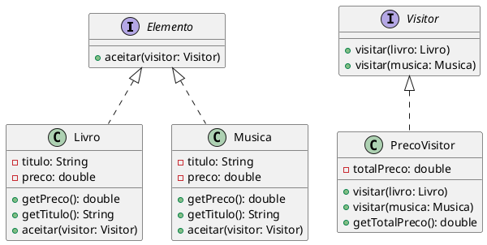

# PPR--Visitor por João Augusto

### Intenção
O padrão Visitor é útil quando você precisa executar várias operações em uma estrutura de objetos que possui uma hierarquia comum, mas deseja evitar sobrecarregar essas classes com novos métodos. Em vez disso, você cria um Visitor que contém as operações e permite que os objetos da hierarquia "aceitem" o visitante. Assim, cada vez que uma nova operação é necessária, você adiciona um novo Visitor, sem modificar a estrutura dos objetos.

#### *Como Funciona*

- Elemento (Element): É a interface ou classe abstrata que define um método accept(Visitor) para "aceitar" um visitante.
- Visitor: É uma interface que define uma série de métodos de visitação, um para cada tipo de elemento (ex: visit(ElementA), visit(ElementB)).
- Elemento Concreto (ConcreteElement): As classes concretas que implementam accept(Visitor), delegando a operação específica ao método do visitante.
- Visitante Concreto (ConcreteVisitor): Implementa os métodos de Visitor, realizando as operações específicas sobre cada tipo de elemento.

Cada Elemento Concreto (como ElementA e ElementB) "aceita" o Visitor e, dentro do método accept, chama o método visit correspondente, delegando a operação ao visitante.

### Também conhecido como
- Double Dispatch

### Motivação
Ao invés de embutir a lógica em múltiplas classes, o Visitor oferece uma maneira de centralizar essas operações, isolando-as da estrutura das classes que elas manipulam. Isso facilita a adição de novos comportamentos sem alterar a estrutura existente.

### Aplicabilidade
Use quando:
- Precisa adicionar frequentemente novas operações em uma hierarquia de classes.
- Deseja evitar a poluição das classes com múltiplos métodos diferentes.

### Estrutura
#### Participantes
- **Visitor**: Define as operações a serem realizadas nos elementos.
- **ConcreteVisitor**: Implementa as operações para os elementos concretos.
- **Element**: Declara um método para aceitar um Visitor.
- **ConcreteElement**: Implementa a interface `Element` e aceita um Visitor.

#### Diagrama do padrão de projeto Visitor:


Esse diagrama representa a interação entre o `Visitor`, os elementos que ele visita (`ElementA` e `ElementB`), e o visitante concreto (`ConcreteVisitor`) que implementa a lógica de visitação.

### Colaborações
- O `Visitor` é passado a cada `Element`, permitindo a execução de uma operação sem que o `Element` precise conhecer os detalhes da operação.

### Consequências
- **Vantagens**:
- Facilita a adição de novas operações, permitindo maior flexibilidade.
- Agrupa operações relacionadas e separa operações não relacionadas: reduz espalhamento de funcionalidades e embaralhamento.
- **Desvantagens**:
 - Dificulta a adição de novos tipos de elementos, pois todos os visitantes existentes precisam ser atualizados.
 - Quebra de encapsulamento: métodos e dados usados pelo visitor têm de estar acessíveis.
### Exemplo de Código

Aqui está um exemplo básico em pseudocódigo:

```java
interface Visitor {
    void visit(ElementA a);
    void visit(ElementB b);
}

class ConcreteVisitor implements Visitor {
    void visit(ElementA a) {
        // Lógica específica para ElementA
    }
    void visit(ElementB b) {
        // Lógica específica para ElementB
    }
}

interface Element {
    void accept(Visitor visitor);
}

class ElementA implements Element {
    void accept(Visitor visitor) {
        visitor.visit(this);
    }
}

class ElementB implements Element {
    void accept(Visitor visitor) {
        visitor.visit(this);
    }
}
```

Aqui, os elementos (ElementA e ElementB) aceitam um visitante (Visitor), que executa operações distintas dependendo do tipo de elemento.


### Meu exemplo

Cenário: Temos uma estrutura de classes que representa diferentes tipos de elementos de uma loja, como Livro e Música. Vamos usar o padrão Visitor para calcular o preço total dos itens e para exibir detalhes. 


#### Diagrama



```java

// Elemento
interface Elemento {
    void aceitar(Visitor visitante);
}

// Visitante
interface Visitor {
    void visitar(Livro livro);
    void visitar(Musica musica);
}

class Livro implements Elemento {
    private String titulo;
    private double preco;

    public Livro(String titulo, double preco) {
        this.titulo = titulo;
        this.preco = preco;
    }

    public double getPreco() {
        return preco;
    }

    public String getTitulo() {
        return titulo;
    }

    @Override
    public void aceitar(Visitor visitante) {
        visitante.visitar(this);
    }
}

class Musica implements Elemento {
    private String titulo;
    private double preco;

    public Musica(String titulo, double preco) {
        this.titulo = titulo;
        this.preco = preco;
    }

    public double getPreco() {
        return preco;
    }

    public String getTitulo() {
        return titulo;
    }

    @Override
    public void aceitar(Visitor visitante) {
        visitante.visitar(this);
    }
}

class PrecoVisitor implements Visitor {
    private double totalPreco;

    @Override
    public void visitar(Livro livro) {
        totalPreco += livro.getPreco();
        System.out.println("Visitando livro: " + livro.getTitulo() + ", Preço: " + livro.getPreco());
    }

    @Override
    public void visitar(Musica musica) {
        totalPreco += musica.getPreco();
        System.out.println("Visitando música: " + musica.getTitulo() + ", Preço: " + musica.getPreco());
    }

    public double getTotalPreco() {
        return totalPreco;
    }
}

import java.util.ArrayList;
import java.util.List;

public class Loja {
    public static void main(String[] args) {
        List<Elemento> elementos = new ArrayList<>();
        elementos.add(new Livro("Java Completo", 49.90));
        elementos.add(new Musica("Hit do Verão", 29.90));

        PrecoVisitor precoVisitor = new PrecoVisitor();
        
        for (Elemento elemento : elementos) {
            elemento.aceitar(precoVisitor);
        }

        System.out.println("Preço total: " + precoVisitor.getTotalPreco());
    }
}

```
#### Explicação
- Elemento: Define a interface Elemento que tem um método aceitar para receber um visitante.
- Visitante: Define a interface Visitor com métodos para visitar diferentes tipos de elementos.
- Classes Concretas: Livro e Musica implementam Elemento e aceitam um visitante.
- Visitante Concreto: PrecoVisitor implementa Visitor e calcula o preço total, além de imprimir detalhes dos itens.
- Uso: Na classe Loja, instanciamos os elementos e usamos o visitante para calcular o preço total.
